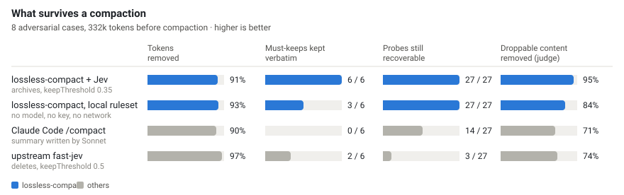
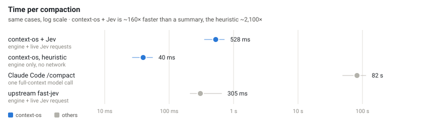

# Lossless Compact

### Shrink your coding agent's context by ~90 % — without it forgetting a thing.

## We've all been there…

Your Claude Code session gets long. You have two choices, and both hurt:

| | Cost | Quality | Speed | |
| :-- | :-: | :-: | :-: | :-- |
| **Let the chat grow** | ❌ | ❌ | ❌ | Every turn re-sends the whole history, so each one costs more and takes longer than the last — and the longer it gets, the sloppier the answers. |
| **Run `/compact`** | ✅ | ❌ | ❌ | Cheaper — but now the model works from a summary of your history that it wrote from memory, and quality drops *further*. The exact port number, file path or error you needed? Paraphrased or gone, and nobody tells you which. And writing that summary takes a minute or two, every time. |

That is what `/compact` is: it asks the model to write a summary of
everything so far, throws away the original transcript, and carries on with
just the summary. Which costs you more than it looks:

- **It rewrites your history in its own words.** The exact port number from
  a `.env` file, the file path from ten tool calls ago, the precise wording
  of an error — all of that gets paraphrased, or just quietly dropped.
- **You won't know what got lost.** There's no list of what was kept vs.
  dropped, and no way to check.
- **There's no undo.** Once the original is gone, it's gone. If the summary
  missed something, you find out later, when the agent contradicts itself or
  re-does work it already did.
- **It's slow.** A real `/compact` on a large session takes anywhere from
  50 seconds to a couple of minutes, because it's a full model call over the
  whole context.

## Meet Lossless Compact

Yes, you can have your cake and eat it too: shrink the context, forget nothing.

| | Cost | Quality | Speed | |
| :-- | :-: | :-: | :-: | :-- |
| **Compact losslessly** | ✅ | ✅ | ✅ | The same ~90 % smaller context, in under a second — and nothing rewritten. What stays is the original bytes; what goes is archived, exact and searchable, and back in front of the model in one command. |

lossless-compact is a plugin for Claude Code (and Cursor, through the same
extension). It takes over compaction — `/compact`, auto-compaction, all of
it — and does the job completely differently: it keeps the exact bytes of
everything that still matters, and moves everything else into a searchable
archive instead of deleting it. If it archived something you needed, you get
it back verbatim, on request, in milliseconds. Nothing is ever paraphrased,
and it runs in under a second instead of a minute or two.

## See it side by side

<picture>
  <source media="(prefers-color-scheme: dark)" srcset="docs/img/compare-dark.svg">
  
</picture>

Both approaches free up roughly the same amount of space (~90%). The
difference is what's left afterward: Claude Code's built-in summary keeps
**zero** of the six things every test case says must not be lost, and
permanently loses 13 of the 27 exact details planted in the test transcripts.
lossless-compact keeps all six, word for word, and can still find every one
of the 27 details afterward — because instead of deleting them, it archived
them. Full methodology and numbers: [docs/evals.md](docs/evals.md).

## Get it running (2 minutes)

The easiest way: open a chat in Claude Code or Cursor and paste this in —
it'll run the setup itself and ask you anything it needs to know (like
whether you have a Jev API key; you don't need one to get started):

```
Set up the lossless-compact plugin for me:
1. Add "CLAUDE_CODE_ENABLE_FUNCTION_HOOKS": "1" to ~/.claude/settings.json
   (merge it in, don't overwrite the file).
2. Ask me if I have a Jev / TypeSafe API key. If yes, add it to the same
   settings.json as "TYPESAFE_API_KEY". If no, skip this — the plugin still
   works fully without one, using a local no-model fallback.
3. Run: claude plugin marketplace add MusicStudioNYC/lossless-compact
4. Run: claude plugin install lossless-compact@lossless-compact
5. Tell me to start a brand-new chat and type /lossless to confirm it's active.
```

Prefer to do it by hand instead? Same five steps, typed yourself, are in
[Full install & configuration](#install-in-claude-code) below.

Works with:

- ✅ **Claude Code** — terminal CLI and the VS Code extension
- ✅ **Cursor** — through the Claude Code extension for Cursor (same plugin, same install)
- ⏳ **Codex** — coming soon; the engine is host-agnostic (see [docs/plan.md](docs/plan.md), "Codex second")

---

Everything below this line is the technical detail — how it decides what to
keep, the full numbers, the library API, and how to configure it. You don't
need any of it to use the plugin.

## What it does at compaction time

```
transcript ──► ledger (stable event ids)
           ├─ pin      first message + newest N messages
           ├─ protect  unresolved errors · results later quoted / referenced by the user
           │           · results of non-reproducible tools · files being edited right now
           ├─ dedupe   identical tool+input+result seen again later
           ├─ classify Jev (TypeSafe) or a local ruleset (no model), over a redacted, sketched state
           ├─ decide   PIN_VERBATIM · KEEP_VERBATIM · KEEP_HEAD_TAIL · RERUN_ON_DEMAND
           │           · ARCHIVE_ONLY · DROP_REDUNDANT — each with reasons
           ├─ archive  every evicted unit, exact, under .lossless-compact/ with provenance
           └─ rebuild  stubs name the archive id; removed calls leave a marker
```

User and assistant text is never removed or rewritten (a removed tool call
appends a one-line marker to the message that narrated it, so a later turn
cannot mistake narration for work still in context; Claude Code gives each
call its own text-less message, so there the marker stands alone, and a run
of removed calls becomes one line naming every archive id). Tool call ↔
result structure is always preserved. If the classifier fails or is unsure,
content stays.

Before compacting, the exact transcript is written to
`.lossless-compact/snapshots/<session>/<compaction>.json`, and one note is inserted
after the first message telling the model what was removed and where the
snapshot, the archive and the raw Claude Code session log
(`~/.claude/projects/…/<session>.jsonl`, which compaction never modifies) are,
so it can grep or read any removed message itself.

## How it compares

Eight adversarial scenarios, 332k tokens in all — a port that only ever
appeared in a `cat .env.example` result, a constraint stated late, an
approach the user rejected, a root cause that looks obsolete, a needle in
pages of log output — each compacted once by every mode. Every scenario
labels the tool results that must survive and plants probes: exact strings
that must still be findable afterwards. The first three columns are exact substring scores; the
last is a Sonnet judge reading the compacted context (the only fair way to
score a summary, and ~6 % noisy). Method and full tables:
[docs/evals.md](docs/evals.md).

- **Same reduction, nothing lost.** `/compact` and lossless-compact both cut the
  context by ~90 %. The summary keeps none of the six must-keeps verbatim and
  loses 13 of 27 probes for good; lossless-compact keeps all six as the original
  bytes and can bring any of the 27 back by id. Asked more loosely, the judge
  finds all six must-keeps *mentioned* in the summary, paraphrased — a
  summary's port number or id is as reliable as the summarizer.
- **Less junk carried.** 29 % of the content labelled droppable is still in
  the summary; 5 % in ours, which is the judge's noise floor.
- **Every summary rewrote everything** (8/8). lossless-compact never rewrites a
  byte: a compacted transcript is still greppable, diffable and quotable.
- **The local ruleset is the no-key fallback.** A hand-written, deterministic
  set of rules — which tools are cheap to re-run, what reads like an error,
  how old a result is — with no model and no network. Same reduction; it
  misses three of the six needles that nothing later refers to — the semantic
  call Jev is for — but archives them, so `/lossless restore` or prompt
  retrieval brings them back.

<picture>
  <source media="(prefers-color-scheme: dark)" srcset="docs/img/latency-dark.svg">
  
</picture>

A summary is one full-context model call: 82 s per compaction on these
≤ 70k-token cases (50–112 s), and 93–135 s on a real 255–294k-token session.
lossless-compact + Jev took ~0.5 s here including the Jev round trips (the engine
itself is ~47 ms) and 819 ms end-to-end on that same real session
(258k → 49k tokens); the local ruleset, 40 ms. Jev bills a few small requests per
compaction — under a cent. On real Claude Code sessions of 100k–330k tokens
lossless-compact removes ~49 % with Jev and ~46 % with the local ruleset; how a
summary's recall holds up past 200k tokens is the open question, answered
once a few of those sessions are labelled.

### The upstream project

lossless-compact is a fork of
[tamaratran/fast-jev-compaction](https://github.com/tamaratran/fast-jev-compaction),
and the idea it stands on is theirs: instead of asking a frontier model to
rewrite the conversation, ask [Jev](https://typesafe.ai), a small, fast
classifier, one question per tool result — will this be needed again? — and
act on the answers. That is what makes a compaction cost milliseconds and
fractions of a cent, its `compact()` engine still ships here unchanged, and
their issue tracker did much of the calibration work this fork picks up
(threshold sweeps, result previews, the narration-marker bug). On the same
cases their default removes more, 97 %, and with it four of the six
must-keeps and 24 of the 27 probes, because a deleted result is gone. The
difference is the archive, the deterministic protections and a calibrated
threshold; [UPSTREAM.md](UPSTREAM.md) lists everything kept, fixed and
diverged.

## Install in Claude Code

Needs Claude Code 2.1.274 or newer (`claude --version`); function hooks did
not exist before that.

1. Turn on function hooks, and give the plugin a Jev key if you have one
   (leave `TYPESAFE_API_KEY` out to run the local ruleset — no model, no
   network, no key, still verbatim and reversible):

   ```json
   // ~/.claude/settings.json
   { "env": { "CLAUDE_CODE_ENABLE_FUNCTION_HOOKS": "1", "TYPESAFE_API_KEY": "apikey_…" } }
   ```

2. Install at user scope, so every project gets it:

   ```sh
   claude plugin marketplace add MusicStudioNYC/lossless-compact
   claude plugin install lossless-compact@lossless-compact
   ```

3. Start a new session and type `/lossless` in full (in the terminal it is in
   the slash-command menu from the first keystroke; the VS Code and Cursor
   extensions list it as `/lossless-compact:lossless`, which works too — see
   [`/lossless`](#lossless)). The report should start with `lossless-compact`
   and name `jev` (with a key) or `ruleset` (without one, with a line saying
   so).

   A session that was already open before step 2 does not have the plugin, and
   `/reload-plugins` does not load a hooks module into a running process (it
   reports `hooks modules unchanged`). In the VS Code extension every chat tab
   is its own `claude` process, so open a new chat (or resume the old session
   in one). In a tab without the plugin, `/compact` is Claude Code's own
   summary — a minute or more on a large context, and no `[lossless-compact]` note
   afterwards.

Or from a checkout, for one session: `CLAUDE_CODE_ENABLE_FUNCTION_HOOKS=1 claude --plugin-dir .`

Auto-compaction: the plugin asks the host to compact once the live context
holds `compactAtTokens` tokens (default 120,000 — a count, so "big" does not
move when the model's window does; `compactAtPercent` is an optional second
trigger, off by default), and every compaction — yours, Claude Code's own
near the limit, or the plugin's — goes through the same hook, so none of
them summarize. `/lossless` shows the plugin's usage and archive state.

Without a `TYPESAFE_API_KEY` the plugin runs the local ruleset —
no model, no network, ~200 ms on a 300k-token transcript — and says so once
per place it matters: a dim line at session start (terminal), a line under
`Classifier:` in `/lossless`, and a line in the compaction note, each with
the honest figure (on the eval the ruleset leaves 3 of 6 must-keep results in
place verbatim where Jev keeps 6 of 6; everything is archived either way).
Choosing `classifier: ruleset` outright gets no such line. With a key (env var, settings
`env`, or the plugin's `apiKey` option) it uses Jev. `/compact` and
auto-compaction both go through it; the compaction toast reads `lossless-compact kept N/M
messages, archived K units, no summary (…)`, or `fallback to built-in summary
(…)` when it could not remove enough or something failed — in that case the
note still goes into the summarized transcript, since the archive and the
snapshot were written first. The VS Code extension shows no toasts at all (the
host runs it as a headless session), so the note's second line carries the
same facts: `Classifier: jev · ~76,677→35,607 tokens (54% fewer) · 145→102
messages · 894 ms.`

When the classifier keeps *none* of five or more results it scored — either
a wrong threshold or a stretch of the session whose tool output really was
disposable — the plugin does not guess: it asks a model that has read the
conversation (the session's own model over its transcript, cache-shared; a
small model with your turns quoted when that is cold) whether removing them
all is right. "Yes" proceeds, "keep these" re-runs with those kept, and
anything else asks you: remove them (archived, restorable), remove and don't
ask again this session, or use Claude's summary. The log says what was
found, who reviewed it and what was decided.

In a headless session (`claude -p`, the SDK — and the VS Code and Cursor
extensions run every chat as one) the host does not let a plugin call
`$.session.compact()` between turns, so when the `compactAtTokens` trigger
fires the plugin runs the `/compact` command instead, queued for the moment
the session is idle: the same `session.compact` event, the same hook, no
summary. The extension shows it as it shows a typed `/compact`. A crossing of
the threshold fires once; the trigger re-arms when the context has dropped
below it or grown by a quarter since, so a compaction that fell back cannot
loop. And when the plugin's own trigger finds too little to remove (under
`minReductionRatio`, because most of the context is protected), it leaves
the conversation as it is and waits for it to grow — only a typed `/compact`
or the host's own near-limit compaction fall back to the built-in summary,
since those need the room now.

### `/lossless`

```
/lossless [status]           active tokens, archived tokens, constraints found, classifier, last compaction
/lossless list [n]           newest archived records
/lossless why <id>           the action and every reason behind it
/lossless show <id>          print the exact archived content
/lossless restore <id>       put the exact content back in front of the model for this turn
/lossless retrieve <query>   lexical search over the archive
```

Typed in full, `/lossless …` runs the plugin's command directly: no model
turn, the answer prints as the command's output. In the terminal it is in the
slash-command menu from the first keystroke. The VS Code and Cursor
extensions fill their menu once at startup from the commands on disk, so
there the menu shows the plugin's static `commands/lossless.md` as
`/lossless-compact:lossless` instead; picking that runs a prompt, and the
plugin's `skill.prompt` hook swaps the command's answer in before the model
reads it, so the model relays it (one short model turn). Typing `/lossless`
in full works in the extensions too, without the turn. Claude Code's own
`/context` (the usage grid) is left alone.

Options live in `~/.claude/settings.json` under
`pluginConfigs["lossless-compact@lossless-compact"].options` (the terminal
CLI's `/config` lists them too; project settings are not read):

```json
{ "pluginConfigs": { "lossless-compact@lossless-compact": { "options": { "compactAtTokens": 100000 } } } }
```

Archive ids appear in the stubs the model sees, e.g.
`[lossless-compact archived e_3f9a…: 8421 more chars of this Read result (file_path=src/a.ts); /lossless restore e_3f9a… brings it back verbatim, or re-run the tool]`.

### Plugin options

| Option | Default | Description |
| --- | --- | --- |
| `classifier` | `auto` | `auto` = Jev when a key is available, else `ruleset`; or force `jev` / `ruleset` |
| `keepThreshold` | classifier's own | Jev 0.35, ruleset 0.4 (see [docs/evals.md](docs/evals.md)) |
| `questionStyle` | `useful` | Jev wording: `useful` (with criteria) or `upstream` |
| `safetyMargin` | 0 | Scores this far below the threshold still keep |
| `preserveRecentMessages` | 6 | Newest messages never touched |
| `sketches` | true | Show the classifier a tool-aware sketch of each result |
| `redact` | true | Replace keys, tokens and passwords before anything is sent to a classifier |
| `markRemovedCalls` | true | Marker in a message whose tool calls were archived |
| `archiveDir` | `.lossless-compact` | Where the archive and snapshots live, relative to the project |
| `snapshot` | true | Write the exact pre-compaction transcript to `.lossless-compact/snapshots/` |
| `noteRemoved` | true | Insert one message into the compacted transcript saying what was removed and where the snapshot, archive and raw session log are |
| `autoRetrieve` / `retrieveBudgetChars` | true / 6000 | Search the archive before each prompt and hand the model the best exact matches |
| `compactAtTokens` | 120000 | Live context size that triggers auto-compaction (0 = off) |
| `compactAtPercent` | 0 | Optional second trigger as a share of the model window (0 = off) |
| `minReductionRatio` | 0.25 | Below this the built-in summary is used instead |
| `truncateHeadChars` | 300 | Head of a result kept in a stub |
| `maxStateTokens` / `maxRequestTokens` | 25000 / 30000 | Jev state and request budgets |
| `model` / `apiKey` | `jev-latest` / env | TypeSafe model and key |

Add `.lossless-compact/` to the project's `.gitignore`.

## Library

```ts
import { optimize, FileArchive, JevClient, JevClassifier, RulesetClassifier } from 'fast-jev-compaction';
import { nodeFs } from 'fast-jev-compaction/dist/node/fs.js';

const result = await optimize(messages, {
  sessionId: 'abc',
  archive: new FileArchive(nodeFs, { root: '.lossless-compact' }),
  classifier: process.env.TYPESAFE_API_KEY
    ? new JevClassifier(new JevClient())
    : new RulesetClassifier(),
});
result.messages;   // the compacted transcript (untouched messages are the same objects)
result.actions;    // one ActionDecision per tool interaction, with reasons and archive ids
result.archived;   // the ArchiveRecords written this time
result.report;     // tokens before/after/archived, action and protection counts, classifier stats
```

`Message` is a subset of Claude Code's `SessionMessage`. The upstream API
(`compact`, `compactMessages`, `fitState`, `batchCalls`, …) is still exported
unchanged. Everything under `src/core`, `src/classifiers`, `src/archive` and
`src/engine` has no Node dependency and runs inside the hook sandbox;
`src/node` holds the transcript loader and the eval runner.

## Evals

```sh
npm run adversarial              # the eight gold scenarios, deterministic
npm run capture -- --limit 20    # your own long sessions from ~/.claude/projects, secrets redacted
npm run eval -- --dataset datasets/v1
```

Every report scores token reduction next to must-keep false drops, probe
retention (active / recoverable from the archive), and transcript validity.
Numbers so far are in [docs/evals.md](docs/evals.md); `npm run charts`
redraws the two figures above from the newest reports.

## Development

```sh
npm install
npm run typecheck        # library + hook sandbox graph
npm test
npm run build
npm run validate:plugin  # needs Claude Code ≥ 2.1.274
```

[docs/architecture.md](docs/architecture.md) describes the layers, the
decision precedence and the storage layout; [UPSTREAM.md](UPSTREAM.md) tracks
the fork.

## Roadmap

Durable memory extraction with provenance and supersession, automatic
retrieval into each turn (`prompt.submit` context), continuous compaction
under a token budget, cache-aware policies, a Codex adapter. The plan is
`docs/plan.md`.
